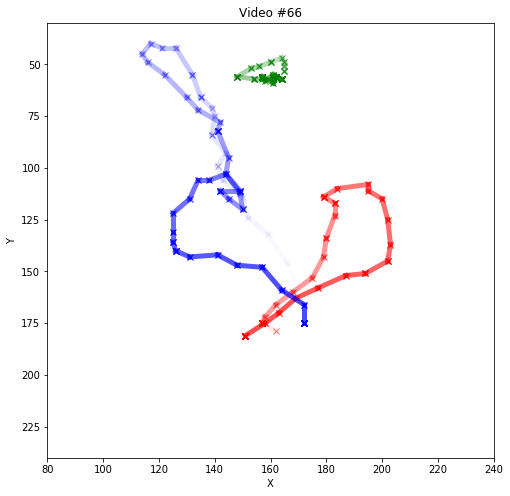
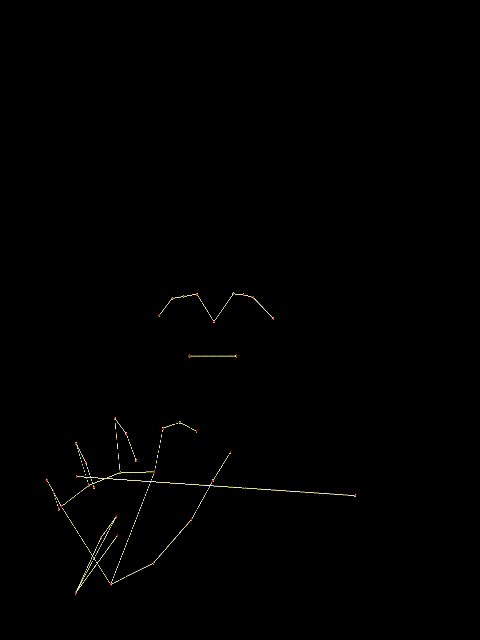
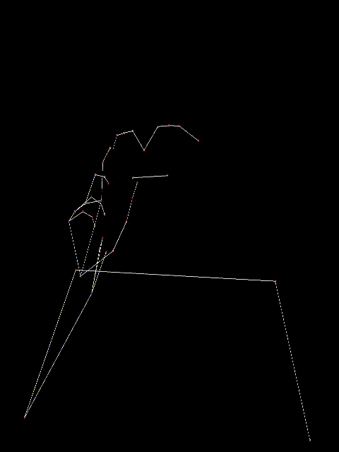
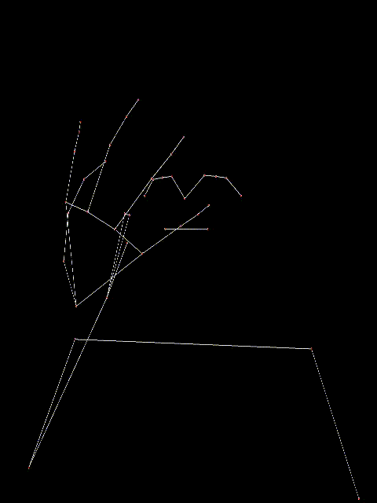
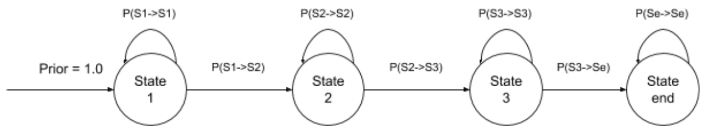
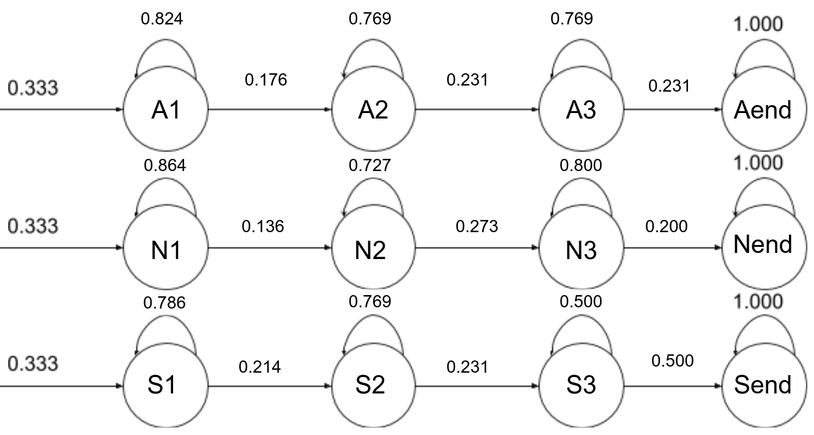

# Assignment 6: Hidden Markov Models

## Setup
1. Clone this repository:

    `git clone (personal repository link).git`
    

2. Navigate to the assignment_6/ directory

3. Activate your AI environment if you're using Anaconda

4. Run the following command to install all requirements for this assignment:

    `pip install -r requirements.txt`

## Overview
Hidden Markov Models are used extensively in Artificial Intelligence, Pattern Recognition, Computer Vision, and many other fields.  If a system has unobservable (hidden) states and each state is independent of the prior, then we can create a model of that system using probability distributions over a sequence of observations.  The idea is that we can provide this system with a series of observations to use to query what is the most likely sequence of states that generated these observations.

### The Files

You will only have to edit and submit **submission.py**, but here are all the notable files:
1. **notebook.ipynb**: Optional Jupyter notebook to complete the assignment.
2. **submission.py**: Where you will ultimately put your probabilities and viterbi trellis.
3. **hmm_submission_tests.py**:  Local test file.  Due to static nature of the trellis values, local tests are extremely limited.  Please do not share values or probabilities with other students if you create your own tests.

## Submission
All submissions will be via Gradescope. If you're completing this assignment in Jupyter Notebook, you must run the `notebook2script.py` file to export your work to a python file. To generate your submission file, run the command 

`python notebook2script.py submission`:

and your file will be created under the `submission` directory.

Upload the resulting `submission.py` file to the Assignment 6A assignment on Gradescope for feedback.

#### IMPORTANT: A total of 10 submissions is allowed for this assignment. Please use your submissions carefully and do not submit until you have thoroughly tested your code locally.

#### If you're at 9 submissions, use your tenth and last submission wisely. The submission marked as ‘Active’ in Gradescope will be the submission counted towards your grade. 

### Resources
1. Canvas Lectures on Pattern Recognition Through Time (Lesson 8)
2. Challenge Questions on Piazza
3. We have provided a copy of the Wikipedia page that has been edited for the benefit of this assignment

#### **WARNING:** Please do not view the official Wikipedia page for the Viterbi Algorithm. Doing so will count as violating the honor code. 

### Local Testing
If you are using `submission.py` to complete the assignment instead of the Jupyter Notebook, you can run the tests using:

`python hmm_submission_tests.py`

This will run all unit tests for the assignment, comment out the ones that aren't related to your part (at the bottom of the file) if going step by step.

## The Assignment
The goal of this assignment is to demonstrate the power of probabilistic models. You will build a word recognizer for American Sign Language (ASL) video sequences. In particular, this project employs [hidden Markov models (HMM's)](https://en.wikipedia.org/wiki/Hidden_Markov_model) to analyze a series of measurements taken from videos of isolated American Sign Language (ASL) signs collected for research. (see the [Isolated Sign Language Recognition Corpus](https://www.kaggle.com/competitions/asl-signs/)).

In each video, an ASL signer signs a meaningful sentence. In a typical ASL recognition system, you observe the XY coordinates of the speaker's left hand, right hand, and nose for every frame. The following diagram shows how the positions of the left hand (Red), right hand (Blue), and nose (Green) change over time. Saturation of colors represents time elapsed.

In this assignment, for the sake of simplicity, you will only use the Y-coordinates of the right hand and the right thumb to construct your HMM. In Part 1 you will build a one dimensional model, recognizing words based only on a series of right-hand Y coordinates; in Part 2 you will go multidimensional and utilize both the right hand and the right thumb features. At this point, you will have two observed coordinates at each time step (frame) representing right hand & right thumb Y positions.

The words you will be recognizing are “ALLIGATOR”, "NUTS", and "SLEEP". These individual signs can be seen in the sign phrases from our dataset: 

 

 ALLIGATOR 
 

 

 NUTS 
 

 

 SLEEP 
 

### Part 1a: Encoding the HMM
### _[CS6601: 15 Points]_ _[CS3600: 25 Points]_

Follow the method described in Canvas **Lecture 8: 29. HMM Training** to determine following values for each word:
1. the transition probabilities of each state
2. the mean & standard deviation of emission Gaussian distribution of each state

Use the training samples from the table below. Provide the transition and prior probabilities as well as the emission parameters for all three words with **accuracy to 3 decimal digits**.

Round the values to 3 decimal places thoughout entire assignment:
- 0.1 stays 0.1 or 0.100
- 0.1234 rounds to 0.123
- 0.2345 rounds to 0.235
- 0.3456 rounds to 0.346
- 0.0123 rounds to 0.012
- 0.0125 rounds to 0.013

Those values can be hardcoded in your program. Don't use round() from python.

Word | Frames | Observed sequence | Initial State1 | Initial State2 | Initial State3
--- | --- | --- | --- | --- | --- 
ALLIGATOR | 17 | 31, 28, 28, 37, 68, 49, 64, 66, 22, 17, 53, 73, 81, 78, 48, 49, 47 | 31, 28, 28, 37, 68, 49 | 64, 66, 22, 17, 53, 73 | 81, 78, 48, 49, 47
ALLIGATOR | 10 | 25, 62, 75, 80, 75, 36, 74, 33, 27, 34 | 25, 62, 75, 80 | 75, 36, 74, 33 | 27, 34
ALLIGATOR | 16 | -4, 69, 59, 45, 62, 22, 17, 28, 12, 14, 24, 32, 39, 61, 35, 32 | -4, 69, 59, 45, 62, 22 | 17, 28, 12, 14, 24, 32 | 39, 61, 35, 32
NUTS | 11 | 45, 68, 62, 75, 61, 44, 73, 72, 71, 75, 55 | 45, 68, 62, 75 | 61, 44, 73, 72 | 71, 75, 55
NUTS | 18 | 33, 33, 32, 32, 34, 38, 43, 41, 35, 36, 36, 37, 38, 38, 39, 40, 38, 38 | 33, 33, 32, 32, 34, 38 | 43, 41, 35, 36, 36, 37 | 38, 38, 39, 40, 38, 38
NUTS | 19 | 33, 31, 29, 28, 25, 24, 25, 28, 28, 38, 37, 40, 37, 36, 36, 38, 44, 48, 48 | 33, 31, 29, 28, 25, 24, 25 | 28, 28, 38, 37, 40, 37, 36 | 36, 38, 44, 48, 48
SLEEP | 8 | 37, 35, 41, 39, 41, 38, 38, 38 | 37, 35, 41 | 39, 41, 38 | 38, 38
SLEEP | 12 | 22, 17, 18, 35, 33, 36, 42, 36, 41, 41, 37, 38 | 22, 17, 18, 35 | 33, 36, 42, 36 | 41, 41, 37, 38
SLEEP | 13 | 38, 37, 35, 32, 35, 13, 36, 41, 41, 31, 32, 34, 34 | 38, 37, 35, 32, 35 | 13, 36, 41, 41, 31 | 32, 34, 34

As shown in the diagram below, each one of the three words (ALLIGATOR, NUTS, and SLEEP) has exactly **THREE hidden states** in its HMM. All words must start from State 1 and can only transit to the next state or stay in the current one.

### _Training sequences need to have 3 hidden states no matter what!_
If you follow the HMM training procedure described in Canvas, you might encounter a situation where a hidden state is **_squeezed_** out by an adjacent state; that is, a state might have its only observation moved to another state. In that situation, always keep at least one observation for that hidden state.

Example:
Assume you've reached a stage where the following is true: 
- State 1 has mean=53 & std=6
- State 2 has mean=37 & std=9
- State 3 has mean=70 & std=8

The next training sample has the following observed sequence:

`45 45 34 | 30 30 25 36 52 | 62 69 74` 

and you are trying to adjust the location of state boundary between State 1 & 2. You first move it 1 step to the left since 34 is closer to State 2, and then you realize that 45 is still closer to State 2. If you follow the same routine, you will end up with no obvervation for State 1. In order to prevent this from happening, you have to stop at the last "45" and as a result leave the boundary as 

`45 | 45 34 30 30 25 36 52 | 62 69 74`

Now you meet the '3 hidden states per sample' requirement.

### Some hints/guidelines for training
#### How should we compare if an observation if closer to one state or another?
Check how many standard deviations away is the observation from the mean for each state. 
Example: Say 46 is the rightmost observation in State 1. If we denote the mean and std of State i as μi,σi, then should we be comparing 
|46−μ1| / σ1 vs |46−μ2| / σ2

#### For HMM training, which side of the boundary should we check first while assigning observed sequence values to states?
After computing the mean and std for each state, adjust the boundary between the states. Always start from the 1st element at the LEFT side of the boundary. If the LEFT element is closer to the next state, then move the boundary leftward. If the LEFT element should stay at the current state, then check the RIGHT element. This is just done to make sure that everyone gets the same results in the context of the assignment.

#### Functions to complete:
1. `part_1_a()`

---

### Part 1b: Creating the Viterbi Trellis
### _[CS6601: 40 Points]_ _[CS3600: 75 Points]_

The goal here will be to use the HMM derived from Part 1a (states, prior probabilities, transition probabilities, and parameters of emission distribution) to build a Viterbi trellis.  When provided with an evidence vector (list of observed right-hand Y coordinates), the function will return the most likely sequence of states that generated the evidence and the probabilty of that sequence being correct.

For example, an evidence vector [38, 37, 35, 32, 35, 13, 36, 41, 41, 31, 32, 34, 34] (last training sequence for "SLEEP") should output a sequence ['S1', ... 'S2', ... 'S3']

If no sequence can be found, the algorithm should return one of the following tuples:
`(None, 0)` (null),  `([], 0)` (empty list) or  `(['A1', 'A1', ... 'A1'],0)` (Or all being the first state of that letter)

"No sequence can be found" means the probability reaches 0 midway. If you find an incomplete sequence with some probability, output that sequence with its probability.

Note: **DO NOT** consult any external sources other than the Wikipedia PDF in the assignment. Failure to abide by this requirement will lead to a 0 on the assignment.

#### Functions to complete:
1. `viterbi()`

#### Hint:
In order to reconstruct your most-likely path after running Viterbi, you'll need to keep track of a back-pointer at each state, which directs you to that state's most-likely predecessor.

You are asked to use the provided function `gaussian_prob` to compute  emission probabilities. In a typical HMM model you have to convert the probability to log-base in order to prevent numerical underflow, but in this assignemnt we will only test your function against a rather short sequence of observations, so **DO NOT** convert the probability to logarithmic probability or you will fail on Gradescope.

#### Gradescope:
In the autograder, we will also test your code against other `evidence_vectors`.

----

### Part 2a: Multidimensional Output Probabilities
### _[Required for CS6601: 6 Points]_ _[Extra Credit for CS3600: 3 Points]_

In Part 1a, we use only right-hand Y-axis coordinates as our feature, and now we are going to use two features - the same right-hand Y-axis coordinates and the right-thumb Y-axis coordinates. Using observations from both the right hand and the right thumb as features can increase the accuracy of our model when dealing with more complex sentences.

Here you are given the transition probabilities and the emission parameters of right-thumb Y-axis locations, following the same procedure conducted in Part 1a.

ALLIGATOR | State 1 | State 2 | State 3
--- | --- | --- | --- 
Mean | 53.529 | 40.769 | 51.000
Std | 17.493 | 6.104 | 12.316

NUTS | State 1 | State 2 | State 3
--- | --- | --- | --- 
Mean | 36.318 | 60.000 | 37.476
Std | 7.376 | 15.829 | 8.245

SLEEP | State 1 | State 2 | State 3
--- | --- | --- | --- 
Mean | 35.357 | 31.462 | 38.333
Std | 7.315 | 5.048 | 7.409

#### Functions to complete:
1. `part_2_a()`

---

### Part 2b: Improving the Viterbi Trellis
### _[Required for CS6601: 39 Points]_ _[Extra Credit for CS3600: 7 Points]_

Modify the Viterbi trellis function to allow multiple observed values (Y locations of the right hand and the right thumb) for a state. The return format should be identical to Part 1b.

Note: **DO NOT** consult any external sources other than the Wikipedia PDF in the assignment. Failure to abide by this requirement will lead to a 0 on the assignment.

#### Functions to complete:
1. `multidimensional_viterbi()`

#### Gradescope:
In the autograder, we will also test your code against other `evidence_vectors`.

---

**CONGRATULATIONS!**  You have just completed your final assignment for CS6601 Artificial Intelligence.

